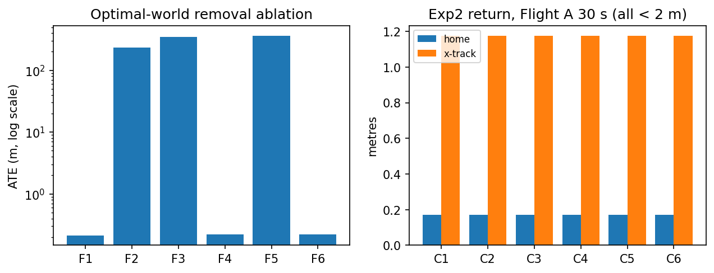
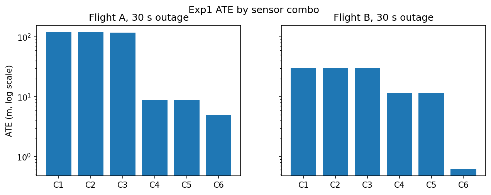
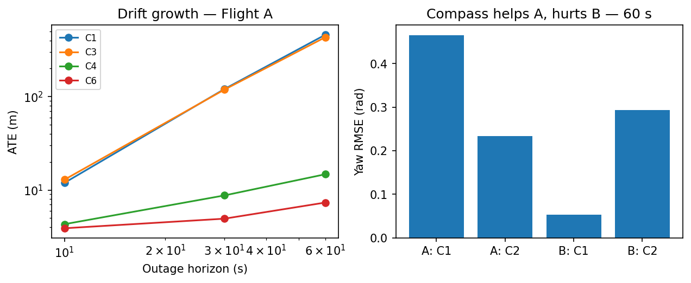
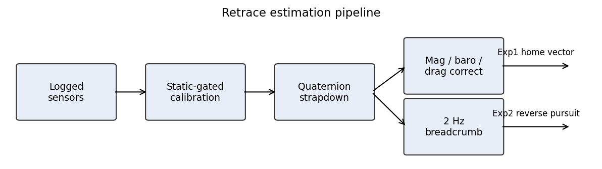

# Optimal Retracement — Which Sensors Bring a Drone Home?

GPS-loss path retrace for multicopters. Six cumulative sensor sets flown
through three testbeds sharing one estimator core: real-log replay, a perfect
analytic world, and a live PX4 SITL square with raw and with perfect sensors.

Paper (prebuilt): [`docs/GPS_LOSS_RETRACE_PAPER.pdf`](docs/GPS_LOSS_RETRACE_PAPER.pdf)

## The setup in 30 seconds

A quadcopter loses GPS mid-flight. Two ways home: **Exp1**, integrate gyro and
accel from the last fix and fly the home arrow; **Exp2**, re-fly the logged
2 Hz breadcrumb trail backwards. Every combo below is scored both ways.

| Combo | Adds                | Why it should help                                              |
| ----- | ------------------- | --------------------------------------------------------------- |
| C1    | gyro + accel (core) | minimum for any inertial navigation                             |
| C2    | + compass yaw       | stops yaw random walk                                           |
| C3    | + barometer         | vertical channel otherwise drifts freely                        |
| C4    | + thrust drag model | rotor drag caps velocity error                                  |
| C5    | + battery current   | thrust scaling when PWM saturates (nil — kept for completeness) |
| C6    | + ZUPT              | kills drift during genuine hover                                |

Truth windows are gated (HDop < 1.0, 10+ sats); outages cut at 10/30/60 s.
Pass bars: < 2% drift at 30 s (Exp1), < 5 m home miss (Exp2).

## Results

### Analytic optimal world — core pair suffices (801 m, exact 100 Hz sensors)

| Run     | Missing        | ATE (m)      | Reading                        |
| ------- | -------------- | ------------ | ------------------------------ |
| F1 full | nothing        | 0.21         | baseline                       |
| F4 / F6 | compass / baro | 0.22         | no loss                        |
| F2 / F3 | gyro / accel   | 232 / frozen | each core sensor necessary     |
| F5      | thrust proxy   | 365          | velocity aid matters even here |



### Real logs — drag wins (ATE, m)

| Log/combo        | 10 s | 30 s  | 60 s  |
| ---------------- | ---- | ----- | ----- |
| A C1 (IMU)       | 11.9 | 120.7 | 460.8 |
| A C3 (+mag+baro) | 12.9 | 119.0 | 433.4 |
| A C4 (+drag)     | 4.3  | 8.8   | 14.8  |
| A C6 (+ZUPT)     | 3.9  | 4.9   | 7.3   |
| B C1 (IMU)       | 2.4  | 30.3  | 223.2 |
| B C4 (+drag)     | 1.7  | 11.4  | 43.1  |
| B C6 (+ZUPT)     | 0.3  | 0.6   | 7.4   |



Without drag, velocity error integrates twice; with it, velocity is capped, so
error grows linearly. Hence 13x on A at 30 s. Compass is conditional: halves yaw
error on A (0.47 → 0.23 rad) but an uncalibrated 0.3 rad bias hurts B
(0.00 → 0.30 rad). Breadcrumb return lands under 2 m for every combo.



### Raw SITL — same ranking, 50x scale (114 m square, PX4 home 0.36 m)

| SITL combo | ATE 3D (m) | Horiz (m) | Vert (m) |
| ---------- | ---------- | --------- | -------- |
| C1 (IMU)   | 2690       | 2690      | 23.9     |
| C2 (+mag)  | 2677       | 2677      | 24.6     |
| C3 (+baro) | 2665       | 2665      | 0.3      |
| C4 (+drag) | 423        | 423       | 0.3      |

Same order as real logs: compass nil, baro fixes vertical only, drag cuts
horizontal 6.3x. Scale differs for measured reasons: +0.46 m/s2 cruise
rectification bias, aliasing spikes to 1137 m/s2 / 37 rad/s at 49 Hz, EKF
height wobble. Quote the ranking, never the magnitudes.

### Perfect SITL — 6 mm, case closed (80 m profile)

| Control combo | ATE (m) | Home (m) |
| ------------- | ------- | -------- |
| C1 (IMU)      | 0.006   | 0.00     |
| C3 (+baro)    | 0.005   | 0.00     |
| C4 (+drag)    | 4.97    | 0.21     |
| C6 (+ZUPT)    | 4.99    | 0.00     |

Same geometry, exact sensors. Raw-vs-perfect: 2690 m vs 0.006 m — the gap is
sensor dirt, measured. (Drag costs 5 m here only because stop-and-go corners
keep it transient against drag-free truth.)



## Reproduce (Windows, ~10 min, no Docker)

1. Python 3.10+, venv in repo root: `py -3.11 -m venv .venv`
2. `.\.venv\Scripts\activate` then
   `pip install numpy scipy matplotlib pymavlink pyyaml`
3. From repo root:
   ```
   .\.venv\Scripts\python.exe -X utf8 -u scripts\retrace\run_matrix.py
   .\.venv\Scripts\python.exe -X utf8 -u scripts\retrace\optimal_world.py
   .\.venv\Scripts\python.exe -X utf8 -u scripts\retrace\sitl_optimal.py
   ```
   Expect: F1 0.21 m; A C4 30 s 8.8 m; SITL-optimal C1 0.006 m.

## Live SITL (Docker + PX4/Gazebo, ~1 h first time)

Full guide in [`sitl/README.md`](sitl/README.md). Short version: build the
RIOTU CUDA image, run container `gpsdnav`, bootstrap the workspace, copy
`sitl/retrace_nav` + `sitl/container/*` into the shared volume, then from repo
root: `.\sitl\RUN_SITL_LOOP.ps1` (params → fly → replay C1-C6 → score).

## Layout

- `scripts/retrace/` — experiment code: `run_matrix.py` (72-row offline
  matrix), `optimal_world.py` (F1-F6), `sitl_optimal.py` (perfect-sensor SITL
  control), `sitl_loop.py` (loop driver), `replay_retrace.py`,
  `estimator.py`, `metrics.py`, `combos.yaml`, tests.
- `sitl/` — live validation package, container scripts, recorded flight bag,
  audit CSVs, loop entry, SITL guide.
- `datasets/flight_logs/` — the two ArduPilot logs (122 MB).
- `output/retrace/` — result CSVs + paper figures.
- `docs/` — prebuilt paper + SITL fix plan.
